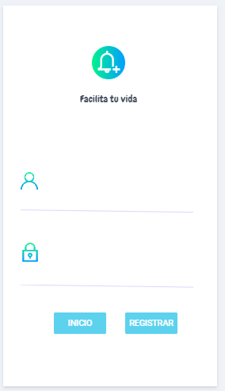
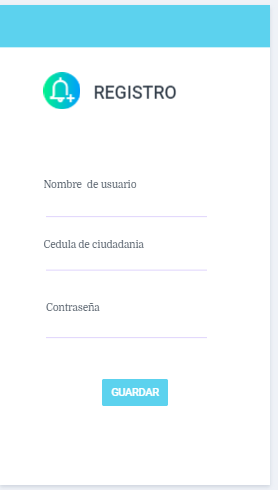
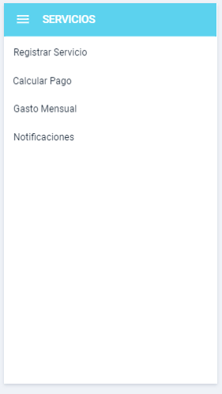
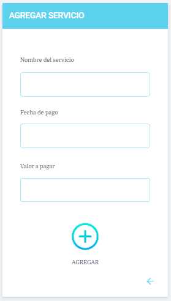
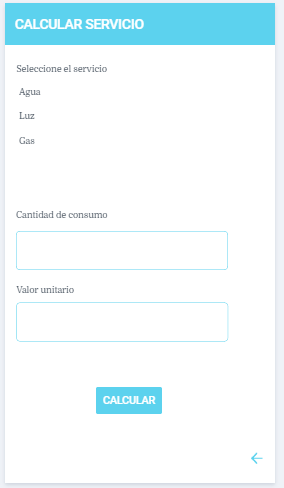
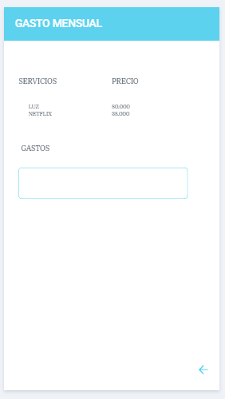
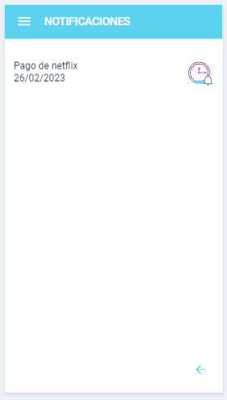

# Diseño de interfaz de usuario

La interfaz de usuario de la aplicación UANRecordatorio esta inspirada en la interfaz de usuario de
aplicaciones similares y en el uso de [Marvel app](https://marvelapp.com/).

El diseño completo esta disponible
en [Marvel app](https://marvelapp.com/prototype/bdbchg1)

1. Inicio de la aplicacion.

   Cuando el usuario ingrese a la aplicaicón verá un Login el cual le permitira acceder a la plataforma o registrarse.
    
    
2. Registrarse en la aplicación.
   
   El usuario debera registrarse en la aplicacion para poder utilizar las funcionalidades de la app.
   
   
   
3. Lista de Funcionalidades.
   
   Cuando el usuario ingrese en la aplicacion, vera una lista de funcionalidades las cuales podra realizar.
   
   
   
4. Agregar Servicio.
   
   El usuario podra registrar un servicio el cual quiere que sea recordado(El campo fecha se despleguara un calendario). 
   
   

5. Calcular pago del Servicio.
   
   El usuario podra calcular el pago de un servicio seleccionado de los que agrego. 
   
   

6. Gasto Mensual.
   
   El usuario podra ver el gasto mensual de los servicios registrados. 
   
   

7. Notificaciones.
   
   El usuario podra ver una lista de los servicios que se le recordaran. 
   
   
